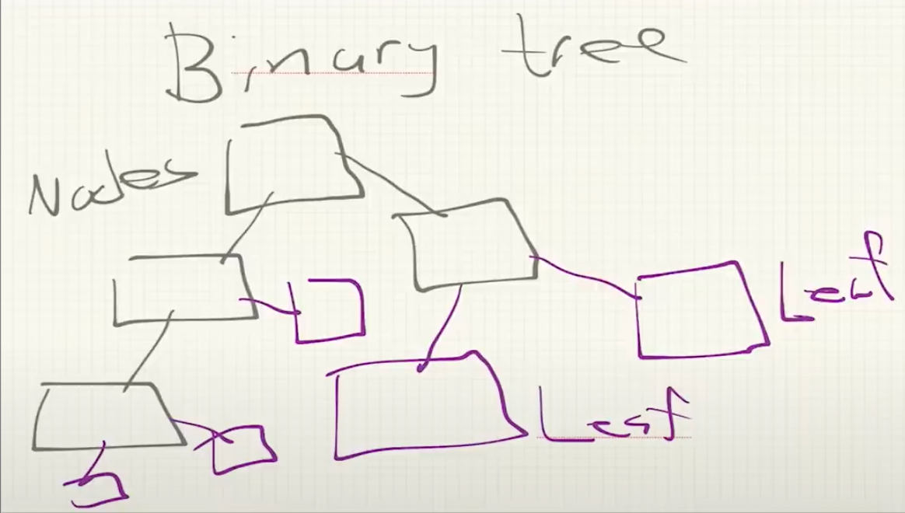
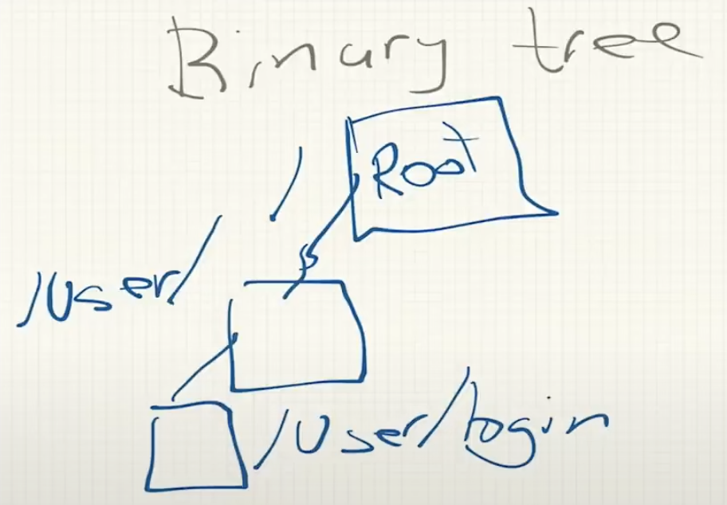
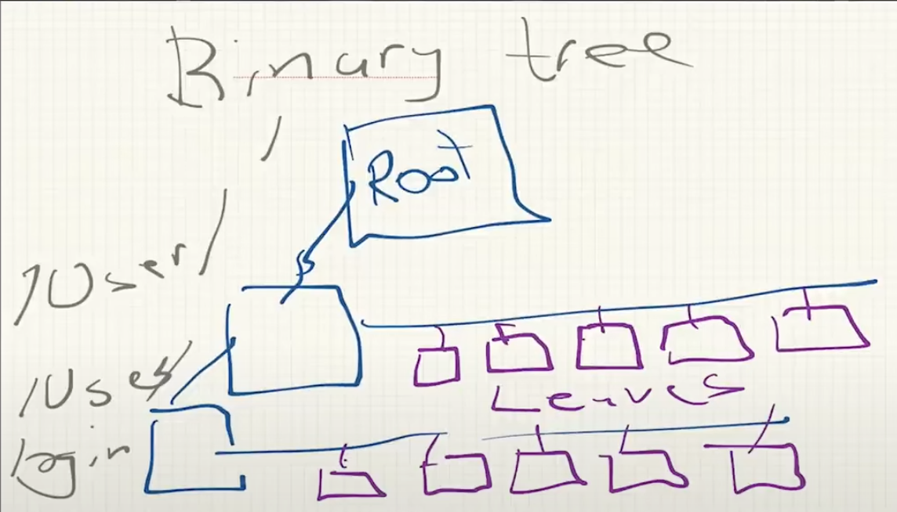

A regular Binary Tree has:
* Nodes: Each one can connect to two other nodes (data structures) maximum
    * Nodes are "connectors" or "hubs" that make up the structure of the tree
    * These nodes don't contain data
* Leaves: End nodes
    * These nodes contain a single element
        * An int, char, or an entire structure
        * We are going to use char pointer w/ a string inside
* Connectors: They connect the binary tree nodes
    * Usually two

Modified Binary Tree will have:
* Root Node: first node
    * Has the path "/"
* Two additional nodes on other layers that go down towars the left:
    * Layer 1 node: 
        * Has the path "/User"
    * Layer 2 Node:
        * Has the path "/User/login"

* The multi-layer nodes will have connectors going towards the right
    * In the original design, there are two leaves per node, but in order to make the design more suitable for a database, we will have multiple leaves on one connector

